# 在 Home Assistant 中安装 seenzus MQTT Bridge — 图文指南

本指南说明如何在 Home Assistant（HAOS / Supervised / Container）中安装并配置 **seenzus MQTT Bridge** 集成。以 **HACS 安装 + 快速配对** 为主线，全程无需手动改文件。

> 适用版本：Home Assistant **2026.3+**。集成 domain 为 `seenzus_bridge`，显示名为 `seenzus MQTT Bridge`。

---

## 前置条件

- Home Assistant **2026.3 或更高版本**
- 已安装 **HACS**
- 一个可用的 **公网 MQTT Broker**
  - 快速配对：由 seenzus 后端自动下发，无需自备
  - 手动配置：需自备（推荐 EMQX Cloud / HiveMQ）

---

## 一、通过 HACS 安装（推荐）

1. 打开 **HACS** → 右上角菜单 → **Custom repositories（自定义仓库）**
2. 仓库地址填：

   ```text
   https://github.com/walllbf/seenzus-mqtt-bridge
   ```

   类别（Category）选 **Integration** → 点击 **Add**
3. 在 HACS 中搜索 **seenzus MQTT Bridge** → 进入 → **Download（下载）**
4. **重启 Home Assistant**

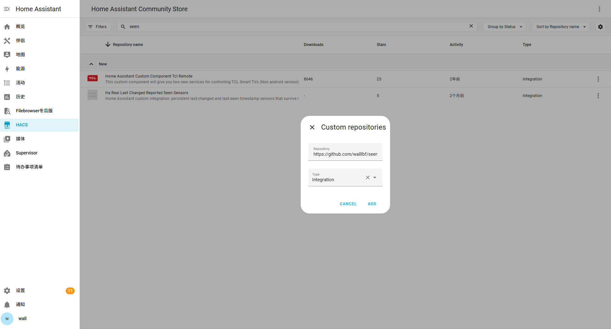

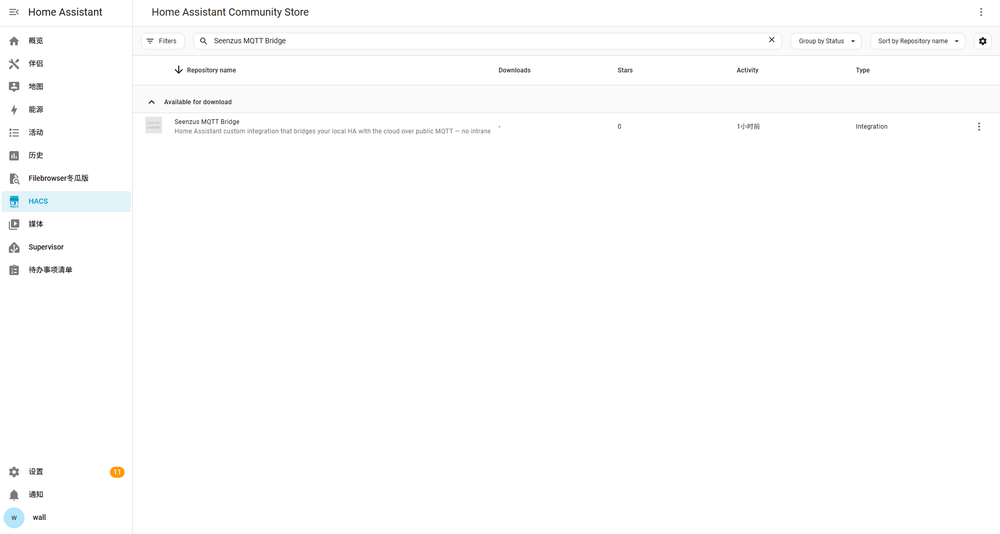

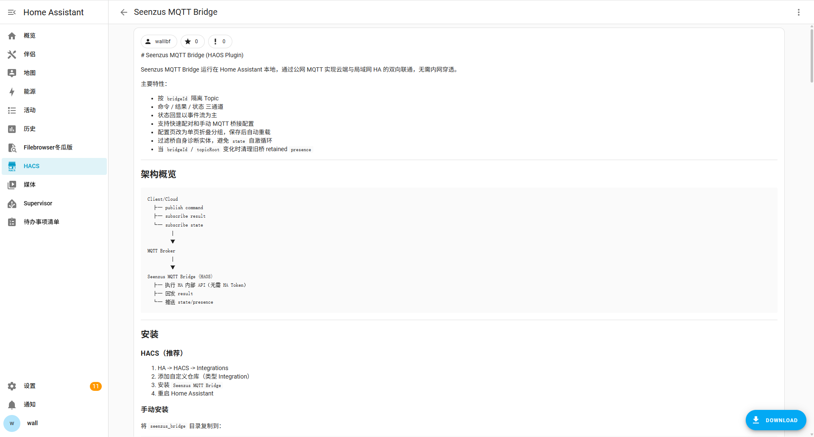

### 备选：手动安装

将 `seenzus_bridge` 目录复制到：

```text
/config/custom_components/seenzus_bridge/
```

确认目录结构后重启 HA：

```text
custom_components/
  seenzus_bridge/
    manifest.json
    __init__.py
    config_flow.py
    coordinator.py
    pairing_bootstrap.py
    bridge_protocol.py
    sensor.py
    strings.json
    brand/
      icon.png
      icon@2x.png
    translations/
      zh-Hans.json
```

---

## 二、添加集成

登录 Home Assistant：

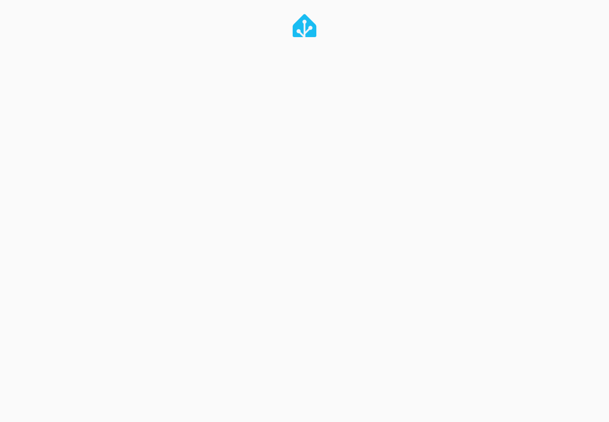

进入首页：

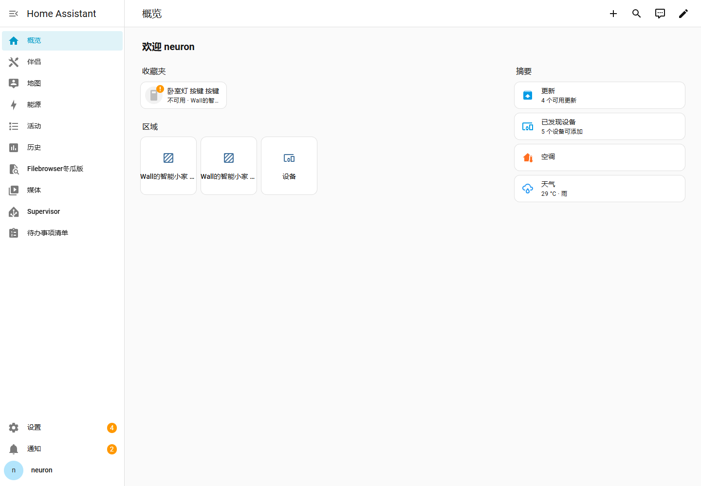

打开 **设置 → 设备与服务 → 集成**：

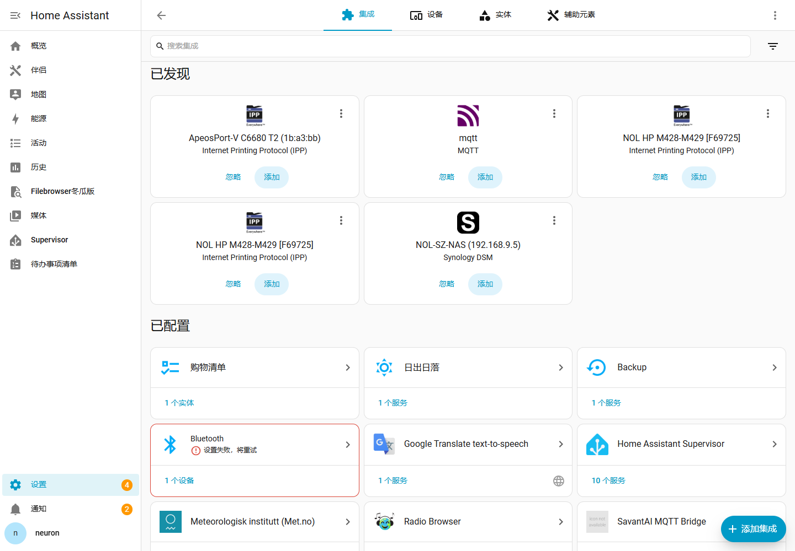

点击右下角 **添加集成**，搜索 **seenzus MQTT Bridge**：

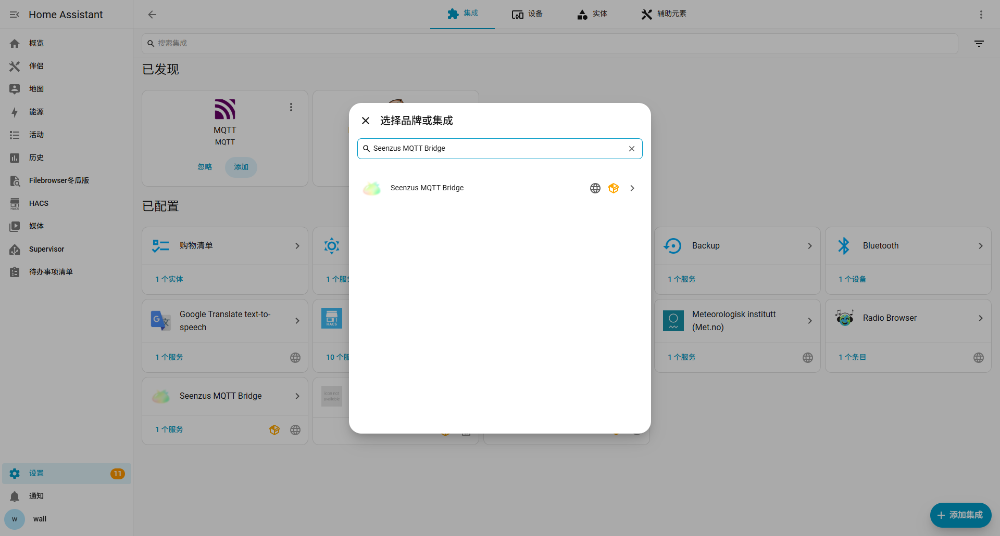

---

## 三、选择配对模式

选择集成后，第一步会让你选择配对模式：

- **快速配对（推荐）** — 对应 `seamless`，通过 seenzus 外部授权自动完成 MQTT 配置
- **手动配置（高级）** — 对应 `manual`，自行填写 MQTT 桥接参数

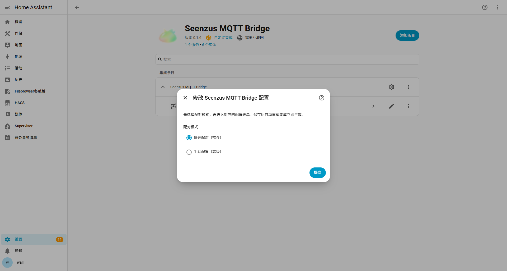

---

## 四、快速配对（推荐）

### 1. 填写 seenzus API 地址

快速配对页只需确认 **seenzus API 地址**，默认即为生产地址：

```text
https://seenzus.ai/api/seenzus
```

> 仅当 HAOS 无法访问默认域名（如纯内网联调）时，才改为当前网络可访问的地址。

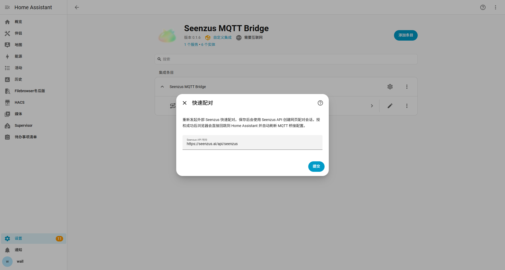

### 2. 外部授权

提交后浏览器会跳转到 seenzus 配对页：

```text
https://seenzus.ai/ha-pairing?session_id=...&redirect_uri=...&bridge_name=seenzus+MQTT+Bridge
```

在该页 **登录你的 seenzus 账号**，确认页面显示的桥接名为 `seenzus MQTT Bridge`，点击 **快速配对 / 确认绑定**：

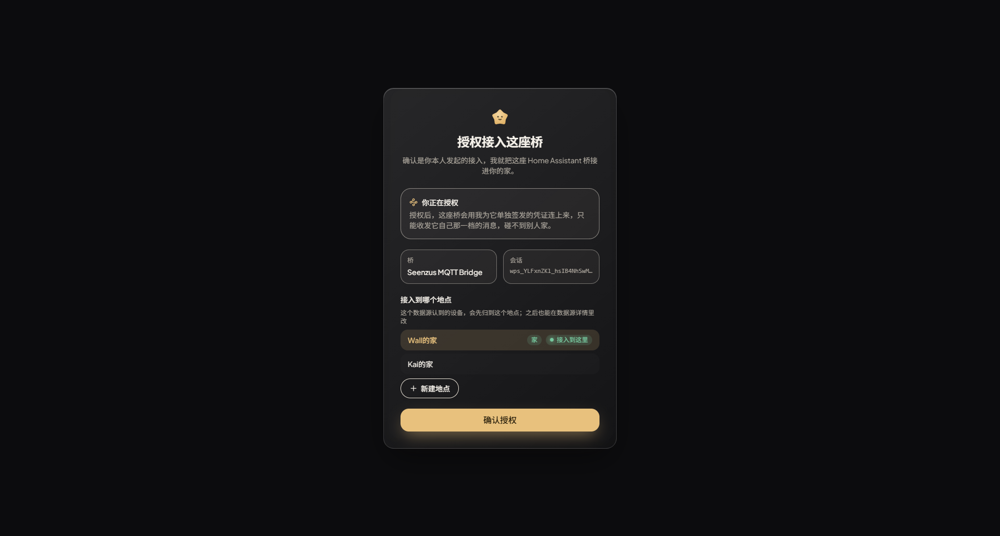

> ⏱️ 配对会话有有效期（约数分钟），请在过期前完成授权；超时后重新发起即可。

### 3. 自动完成

授权成功后，浏览器会自动回跳到 Home Assistant 本地回调：

```text
/api/seenzus_bridge/quick_pair/callback
```

插件随即自动兑换 MQTT 桥接配置（host / port / username / password / topicRoot / bridgeId）并创建集成实例 —— **无需手动重启**。

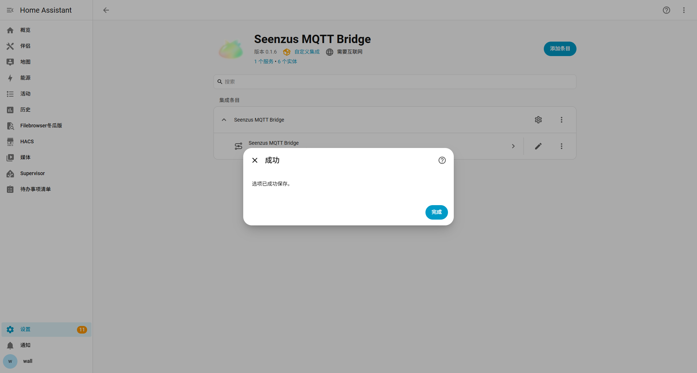

---

## 五、手动配置（高级，可选）

如果你想自己接管 MQTT 桥接，在第一步选择 **手动配置**，填写以下参数：

**MQTT 连接参数**

| 参数 | 说明 | 默认 |
|---|---|---|
| MQTT Broker 地址 | 公网 MQTT 地址 | （必填） |
| MQTT 端口 | Broker 端口 | `1883` |
| MQTT 用户名 / 密码 | Broker 认证 | 空 |

**高级参数**

| 参数 | 说明 | 默认 |
|---|---|---|
| V2 Topic 根路径 | 协议根路径 | `seenzus/v2` |
| Bridge ID | 留空自动生成稳定 ID | 自动 |
| 启用实体状态事件推送 | 推送 `state` 通道 | 开 |
| 允许模板渲染 API | 放行 `POST /api/template` | **关** |
| 允许调用危险服务 | 放行 `hassio.*` / `shell_command.*` 等 | **关** |
| 返回完整 config | `GET /api/config` 含位置坐标 | **关** |

> 后三项为安全开关，默认关闭。除非你明确需要，否则保持关闭。

保存后会自动重载集成，立即生效。

---

## 六、验证安装成功

在 **设置 → 设备与服务 → 集成** 中应出现 **seenzus MQTT Bridge**，并创建以下传感器：

- `seenzus MQTT Bridge 状态` —— 应显示 **运行中**
- 请求次数 / 结果回包次数 / 状态推送次数 / 错误次数
- `seenzus MQTT Bridge 配对状态`

在状态传感器的属性里可看到：`bridge_id`、`mqtt_connected=true`、`pairing_status=bound`（快速配对）。

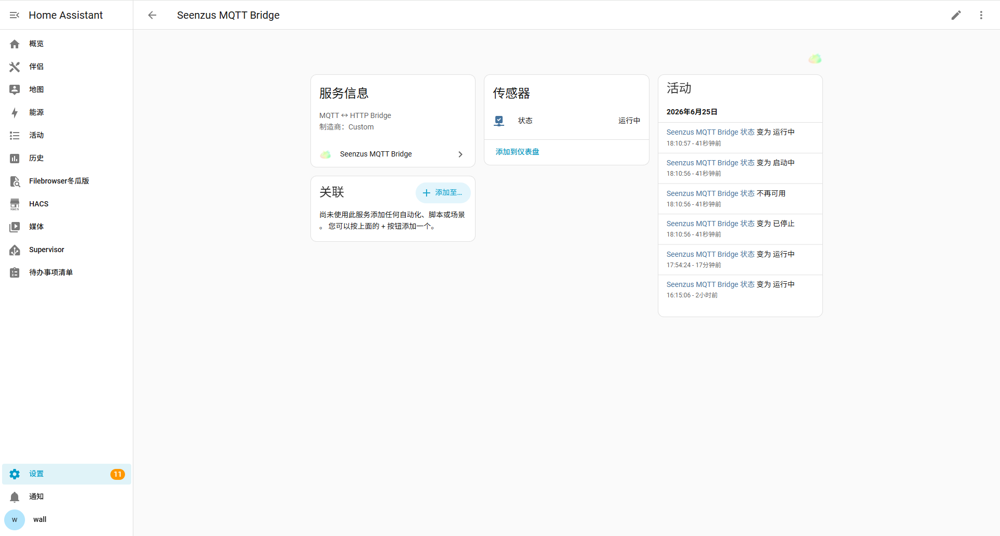

---

## 七、⚠️ 安全提示（务必阅读）

本插件通过公网 MQTT 接收命令并**直接执行 Home Assistant 内部 API（无需 HA Token）**。命令通道本身没有应用层鉴权，**安全完全依赖 MQTT Broker 的 Topic ACL 与凭证**：

- **专用 Broker + 强密码**，不要与不可信方共用
- **按 bridge 配置 Topic ACL**：`{topicRoot}/bridge/{bridgeId}/command/+` 的 **publish 权限只授予可信后端**
- 尽量使用 **8883/TLS** 连接

详见仓库 README 的「🔒 安全部署」章节。

---

## 八、常见问题

**搜不到 seenzus MQTT Bridge？**
确认 HACS 已添加自定义仓库并下载，且**已重启 HA**；手动安装则确认目录为 `/config/custom_components/seenzus_bridge/`。

**快速配对创建会话失败？**
确认 `seenzus API 地址` 可从 HAOS 访问（DNS / 网络）。

**外部授权成功但 HA 没完成配置？**
确认 HA 的访问地址能被浏览器回跳到，即 `/api/seenzus_bridge/quick_pair/callback` 可达。

**集成创建成功但显示离线？**
检查 MQTT Broker 地址 / 账号密码，以及 ACL 是否允许订阅 `command/+` 和发布 `presence`/`state`/`result`/`catalog`。

---

## 附：技术参考

- MQTT Topic 规范、状态回显语义：见仓库 `README.md`
- 快速配对完整流程与后端契约：见 `docs/quick-pair-flow.zh-CN.md`
