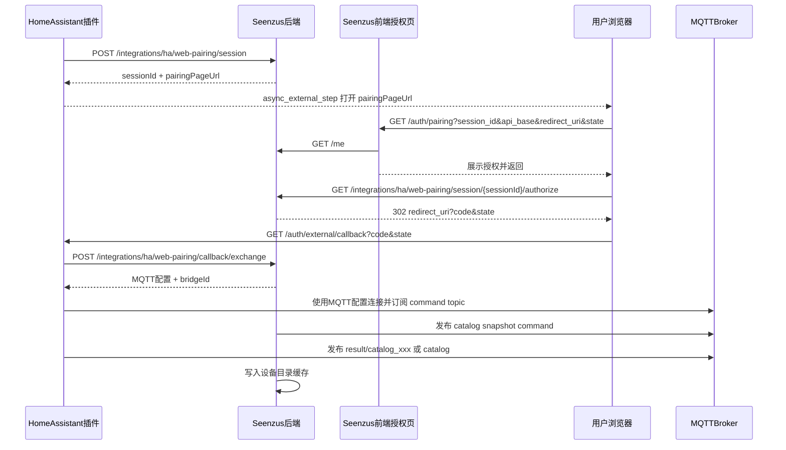

# SavanAI Bridge 快速配对流程

本文档描述 Home Assistant 插件快速配对的完整链路，覆盖插件配置流、Seenzus 前端授权页、后端配对 API、OAuth callback、MQTT 配置落地，以及设备目录刷新。

相关代码位置：

- HA 插件配置流：`seenzusaimqttbridge/config_flow.py`
- HA 插件 HTTP 客户端：`seenzusaimqttbridge/pairing_bootstrap.py`
- HA 插件 MQTT 运行时：`seenzusaimqttbridge/__init__.py`
- 前端授权页：`seenzusaifrontend/client/src/pages/ha-pairing.tsx`
- 前端配对 URL 工具：`seenzusaifrontend/client/src/lib/ha-pairing.ts`
- 后端配对接口：`neuron.seenzusai.api/src/Seenzus.Api/Integrations/HaBridgeEndpoints.cs`
- 后端配对服务：`neuron.seenzusai.api/src/Seenzus.Api/Integrations/Application/HaBridgePairingApplicationService.cs`
- 后端 MQTT 消费：`neuron.seenzusai.api/src/Seenzus.Api/Integrations/Infrastructure/HaBridgeMqttConsumerHostedService.cs`
- 后端 MQTT 分发：`neuron.seenzusai.api/src/Seenzus.Api/Integrations/Infrastructure/HaBridgeMqttMessageDispatcher.cs`

---

## 1. 总体时序



---

## 2. HA 插件发起快速配对

入口在 `SavanAIBridgeConfigFlow.async_step_seamless()`。

用户在 HA 添加集成时选择“快速配对”，插件要求用户填写 `Seenzus API 地址`，例如：

```text
https://test.neuroncloud.ai/gatewayka/savantai
```

插件随后构造 HA callback 上下文：

- `redirect_uri`：`{HA frontend base}/auth/external/callback`
- `pairing_state`：随机字符串，用于插件内部校验
- `state`：HA `_encode_jwt()` 生成的 JWT，包含 `flow_id`、`redirect_uri`、`pairing_state`

对应代码：

```text
_build_quick_pair_callback_context()
```

生成后调用后端：

```http
POST /integrations/ha/web-pairing/session
Content-Type: application/json
```

请求体：

```json
{
  "bridgeName": "SavanAI Bridge",
  "bridgeVersion": "3.0.8",
  "platform": "homeassistant",
  "haVersion": "2026.x.x",
  "redirectUri": "http://<ha-host>:8123/auth/external/callback",
  "state": "<ha_external_step_jwt>"
}
```

后端返回：

```json
{
  "ok": true,
  "sessionId": "<session_id>",
  "status": "pending",
  "authorizeUrl": "<pairing_page_url>",
  "pairingUrl": "<pairing_page_url>",
  "pairingPageUrl": "<pairing_page_url>",
  "expiresAt": "<timestamp>"
}
```

插件保存：

- `_quick_pair_api_base`
- `_quick_pair_page_url`
- `_quick_pair_session_id`
- `_quick_pair_callback_state`
- `_quick_pair_callback_state_token`

然后进入：

```text
async_step_seamless_authorize()
```

第一次进入时返回 HA external step：

```python
self.async_external_step(
    step_id="seamless_authorize",
    url=self._quick_pair_page_url,
)
```

HA 前端会打开 Seenzus 配对授权页。

---

## 3. 后端创建 Web Pairing Session

后端入口：

```text
HaBridgeEndpoints.CreateWebPairingSessionAsync()
```

路由：

```http
POST /integrations/ha/web-pairing/session
```

核心逻辑：

1. 调用 `HaBridgePairingApplicationService.CreateAnonymousWebPairingAsync()`
2. 创建匿名 pairing session，`OwnerId = "__anonymous_web_pairing__"`
3. 保存 `RedirectUri` 和 `CallbackState`
4. 调用 `HaBridgeFrontendUrlBuilder.BuildPairingPageUrl()` 生成前端授权页 URL

授权页 URL 形态：

```text
{HaBridge:FrontendBaseUrl}/auth/pairing
  ?session_id=<session_id>
  &api_base=<api_base>
  &redirect_uri=<ha_callback>
  &state=<ha_external_step_jwt>
  &node_id=<node_id>
```

其中：

- `api_base` 来自 `VANS_API_PUBLIC_BASE`，没有配置时用当前请求 host/pathBase 推导
- 前端 base 来自 `HaBridge:FrontendBaseUrl`

---

## 4. Seenzus 前端授权页

页面入口：

```text
/auth/pairing
```

对应文件：

```text
seenzusaifrontend/client/src/pages/ha-pairing.tsx
```

页面加载后会：

1. 调用 `parsePairingContext(new URLSearchParams(window.location.search))`
2. 校验必须存在 `session_id`、`api_base`、`redirect_uri`、`state`
3. 调用 `useCurrentUserQuery()` 读取当前 Seenzus 登录用户
4. 如果未登录，跳转到：

```text
/login?returnUrl=<当前/auth/pairing完整path和query>
```

用户登录成功后，登录页会读取 `returnUrl` 并回到原配对页。

### 4.1 点击“授权并返回”

按钮点击后执行：

```text
handleAuthorize()
```

它调用：

```text
buildAuthorizeUrl({ apiBase, sessionId })
```

生成：

```text
{api_base}/integrations/ha/web-pairing/session/{sessionId}/authorize
```

然后执行：

```js
window.location.assign(target)
```

### 4.2 localhost 调试特殊逻辑

当页面运行在 `localhost`、`127.0.0.1` 或 `::1`，而 `api_base` 是远程域名时，`buildAuthorizeUrl()` 会把授权请求改走同源代理：

```text
http://localhost:5000/api/integrations/ha/web-pairing/session/{sessionId}/authorize
```

原因是浏览器不会把 `localhost` 的登录 cookie 发送给远程 API 域名。开发环境需配合：

```text
VITE_API_PROXY_TARGET=https://test.neuroncloud.ai/gatewayka/savantai
```

---

## 5. 后端 authorize 授权并回跳 HA

后端入口：

```text
HaBridgeEndpoints.AuthorizeWebPairingSessionAsync()
```

路由：

```http
GET /integrations/ha/web-pairing/session/{sessionId}/authorize
```

处理逻辑：

1. 从当前请求 cookie 解析 Seenzus session
2. 如果未登录：
   - 读取匿名 pairing session
   - 重定向到 Seenzus 登录页
   - 登录页 `returnUrl` 指向原 `/auth/pairing?...`
3. 如果已登录：
   - 调用 `HaBridgePairingApplicationService.AuthorizeWebPairingAsync(user.Id, sessionId)`
   - session owner 从匿名 owner 改成当前用户
   - session 状态变成 `Confirmed`
   - 生成 `CallbackCode`
   - 创建或更新 bridge binding

如果 session 有 `RedirectUri`，后端返回 302：

```text
{redirect_uri}?code=<callback_code>&state=<callback_state>
```

如果没有 `RedirectUri`，则返回 JSON：

```json
{
  "ok": true,
  "sessionId": "<session_id>",
  "bridgeId": "<bridge_id>",
  "callbackCode": "<callback_code>",
  "callbackState": "<state>",
  "confirmedAt": "<timestamp>"
}
```

---

## 6. HA external callback 收尾

浏览器回到 HA：

```http
GET /auth/external/callback?code=<callback_code>&state=<ha_external_step_jwt>
```

HA 内置 `config_entry_oauth2_flow` 会：

1. 解码 `state`
2. 取出 `flow_id`
3. 调用当前 flow 的 `async_step_seamless_authorize(user_input)`

插件收到的 `user_input` 包含：

```python
{
    "code": "<callback_code>",
    "state": {
        "flow_id": "...",
        "redirect_uri": "...",
        "pairing_state": "..."
    }
}
```

插件校验：

- `state` 必须是 dict
- `state["pairing_state"]` 必须等于 `_quick_pair_callback_state`
- `_quick_pair_api_base`、`_quick_pair_callback_state_token` 必须存在

校验通过后调用后端：

```http
POST /integrations/ha/web-pairing/callback/exchange
Content-Type: application/json
```

请求体：

```json
{
  "sessionId": "<session_id>",
  "code": "<callback_code>",
  "state": "<ha_external_step_jwt>"
}
```

---

## 7. 后端 callback exchange

后端入口：

```text
HaBridgeEndpoints.ExchangeWebPairingCallbackAsync()
```

路由：

```http
POST /integrations/ha/web-pairing/callback/exchange
```

核心逻辑：

1. 调用 `HaBridgePairingApplicationService.ExchangeCallbackAnonymousAsync(sessionId, code, state)`
2. 校验 session 存在且未过期
3. 校验 session 状态为 `Confirmed`
4. 校验 `code == session.CallbackCode`
5. 如果 session 保存过 `CallbackState`，校验传入 state 完全一致
6. 查询 active binding
7. 调用 `BuildWebPairingResponse(result, configuration, configSource: "web_pair")`

返回给 HA 插件：

```json
{
  "ok": true,
  "sessionId": "<session_id>",
  "status": "confirmed",
  "bound": true,
  "bridgeId": "<bridge_id>",
  "configSource": "web_pair",
  "confirmedAt": "<timestamp>",
  "expiresAt": "<timestamp>",
  "mqtt": {
    "host": "<mqtt_host>",
    "port": 1883,
    "username": "<mqtt_username>",
    "password": "<mqtt_password>",
    "topicRoot": "savant/v2",
    "bridgeId": "<bridge_id>",
    "clientId": "<bridge_id>"
  }
}
```

MQTT 参数来源是运行时配置：

```text
HaBridge:Mqtt:BrokerUrl
HaBridge:Mqtt:Username
HaBridge:Mqtt:Password
HaBridge:Mqtt:TopicRoot
```

生产或测试部署推荐通过环境变量覆盖：

```text
HaBridge__Mqtt__BrokerUrl
HaBridge__Mqtt__Username
HaBridge__Mqtt__Password
HaBridge__Mqtt__TopicRoot
```

---

## 8. HA 插件创建配置项并连接 MQTT

插件收到 `callback/exchange` 结果后，进入：

```text
async_step_seamless_finish()
```

如果 `_quick_pair_exchange_result` 存在，调用：

```text
_build_quick_pair_entry_data()
```

写入 HA config entry data：

```json
{
  "pairing_mode": "seamless",
  "config_source": "web_pair",
  "pairing_api_base": "<api_base>",
  "pairing_session_id": "<session_id>",
  "pairing_bound_at": "<confirmedAt>",
  "mqtt_host": "<mqtt_host>",
  "mqtt_port": 1883,
  "mqtt_username": "<mqtt_username>",
  "mqtt_password": "<mqtt_password>",
  "topic_root": "savant/v2",
  "bridge_id": "<bridge_id>",
  "source_id": "ha-bridge-<bridge_id>",
  "source_type": "haos_bridge",
  "source_name": "HA Bridge"
}
```

随后 HA 创建配置项：

```python
self.async_create_entry(title="SavanAI Bridge", data=data)
```

插件运行时 `BridgeCoordinator._mqtt_loop()` 读取配置项：

- `mqtt_host`
- `mqtt_port`
- `mqtt_username`
- `mqtt_password`
- `topic_root`
- `bridge_id`
- `source_id`
- `source_type`
- `source_name`

并连接 MQTT：

```python
aiomqtt.Client(
    hostname=host,
    port=port,
    username=username,
    password=password,
    identifier=f"savanai-bridge-{entry_id[:8]}",
)
```

连接成功后：

1. 订阅 command topic
2. 发布 presence online
3. 首次启动发布全量 state snapshot
4. 首次启动发布 device catalog snapshot

---

## 9. MQTT Topic 约定

插件 bridge topic 由 `topic_root` 和 `bridge_id` 生成。默认：

```text
topic_root = savant/v2
bridge_id = bridge-xxxx
```

常用 topic：

```text
savant/v2/bridge/{bridgeId}/command/{msgId}
savant/v2/bridge/{bridgeId}/result/{msgId}
savant/v2/bridge/{bridgeId}/state/{entityId}
savant/v2/bridge/{bridgeId}/presence
savant/v2/bridge/{bridgeId}/catalog
```

后端 MQTT consumer 订阅：

```text
savant/v2/bridge/+/state/+
savant/v2/bridge/+/catalog
savant/v2/bridge/+/presence
savant/v2/bridge/+/result/+
```

---

## 10. 设备目录刷新流程

前端或空间页调用后端设备目录接口：

```http
GET /integrations/ha/bridges/{bridgeId}/device-catalog
```

后端入口：

```text
HaBridgeDeviceEndpoints.GetBridgeDeviceCatalogAsync()
```

处理逻辑：

1. 校验当前用户拥有 active binding
2. 从 `IHaBridgeDeviceCatalogCache` 查询 catalog
3. 如果缓存为空或 `refresh=true`，调用 `RequestCatalogSnapshotAndWaitAsync()`
4. 生成：

```text
msgId = catalog_{Guid.NewGuid():N}
```

5. 通过 MQTT 向插件发布命令：

```text
savant/v2/bridge/{bridgeId}/command/{msgId}
```

命令 payload：

```json
{
  "msgId": "catalog_xxx",
  "method": "GET",
  "path": "/api/seenzus/device-catalog"
}
```

插件 `_handle_message()` 收到后，如果 path 是 `/api/seenzus/device-catalog` 或 `/api/seenzus/devices`：

1. 调用 `_build_device_catalog_payload(source="command", correlation_id=msgId)`
2. 发布命令结果：

```text
savant/v2/bridge/{bridgeId}/result/{msgId}
```

3. 同时尝试发布 catalog snapshot：

```text
savant/v2/bridge/{bridgeId}/catalog
```

后端兼容两种来源写入 cache：

- 固定 catalog topic：`.../catalog`
- 命令结果 topic：`.../result/catalog_xxx`，当 `data.devices` 存在时也写入 `IHaBridgeDeviceCatalogCache`

接口最终返回：

```json
{
  "ok": true,
  "devices": [ ... ],
  "catalog": { ... },
  "snapshotRequested": true,
  "snapshotError": null,
  "ts": "<timestamp>",
  "source": "command",
  "correlationMsgId": "catalog_xxx"
}
```

如果返回：

```json
{
  "ok": true,
  "devices": [],
  "snapshotRequested": true,
  "snapshotError": null,
  "catalog": null
}
```

说明后端发布了 snapshot command，但等待窗口内没有把 catalog 写入 cache。

---

## 11. 常见故障定位

### 11.1 授权页点“授权并返回”后回到原页面

通常是登录 cookie 域不一致。

检查点：

- 授权请求是否访问了远程 `api_base`
- 当前页面是否运行在 `localhost`
- `test.neuroncloud.ai` 下是否存在 `sid` cookie
- localhost 调试时是否启用了 `/api` 同源代理

### 11.2 HA callback 返回 500 UnknownFlow

HA 日志出现：

```text
homeassistant.data_entry_flow.UnknownFlow
```

表示 HA 收到 callback，但 `state.flow_id` 对应的配置流不存在。

常见原因：

- 复用了旧 callback URL
- HA 添加集成页面被刷新或关闭
- HA 重启过
- external step 超时
- 多次点击旧授权链接

处理方式：

1. 删除失败配置项
2. 重新从 HA 发起快速配对
3. 不复用旧 URL
4. 配对期间不要刷新 HA 页面

### 11.3 MQTT Not authorized

HA 日志出现：

```text
MQTT disconnected: [code:135] Not authorized
```

说明插件拿到 MQTT 配置并尝试连接 broker，但 broker 拒绝认证。

检查：

- `GET /integrations/ha/web-pairing/session/{sessionId}` 返回的 `mqtt.username/password`
- HA `.storage/core.config_entries` 里落地的 `mqtt_username/mqtt_password`
- broker 账号是否允许 client 连接
- broker ACL 是否允许 `savant/v2/#`

### 11.4 设备列表为空但 MQTT 能看到 result

如果 MQTT 只看到：

```text
savant/v2/bridge/{bridgeId}/command/catalog_xxx
savant/v2/bridge/{bridgeId}/result/catalog_xxx
```

但没有：

```text
savant/v2/bridge/{bridgeId}/catalog
```

旧后端不会写入 catalog cache。当前后端已兼容 `result/catalog_xxx`，只要 result payload 的 `data.devices` 存在，就会写入 cache。

仍为空时检查：

- 监听到的 `bridgeId` 是否与接口请求的 `{bridgeId}` 完全一致
- result payload 是否有 `data.devices`
- 后端日志是否有 `Failed to process HA bridge MQTT message`
- 后端 MQTT consumer 是否连接了同一个 broker

### 11.5 后端返回 MQTT 仍是 localhost

`BuildWebPairingResponse()` 每次请求实时从 `IConfiguration` 读取 MQTT 配置，不从 session 缓存读取。

如果接口仍返回：

```json
"host": "localhost",
"username": "",
"password": ""
```

说明运行时配置没有生效。

检查：

- 容器内 `appsettings.json`
- `appsettings.Production.json`
- 环境变量 `HaBridge__Mqtt__*`
- 是否部署到了最新镜像
- 网关是否打到旧实例

---

## 12. 快速验证命令

订阅完整桥接 topic：

```bash
mosquitto_sub \
  -h emqx-test.wallbf.site \
  -p 1883 \
  -u admin \
  -P 'Neuron@1234' \
  -t 'savant/v2/bridge/#' \
  -v
```

查询匿名 web pairing session：

```bash
curl "https://test.neuroncloud.ai/gatewayka/savantai/integrations/ha/web-pairing/session/{sessionId}"
```

查询设备目录：

```bash
curl "https://test.neuroncloud.ai/gatewayka/savantai/integrations/ha/bridges/{bridgeId}/device-catalog?refresh=true"
```

查询桥接诊断：

```bash
curl "https://test.neuroncloud.ai/gatewayka/savantai/integrations/ha/bridges/{bridgeId}/diagnostics"
```
